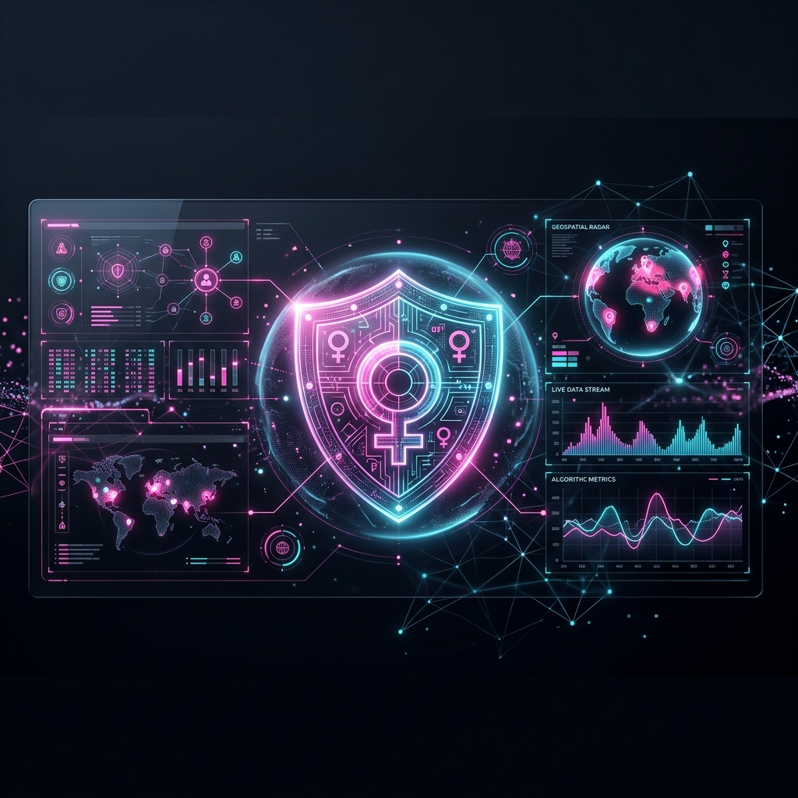
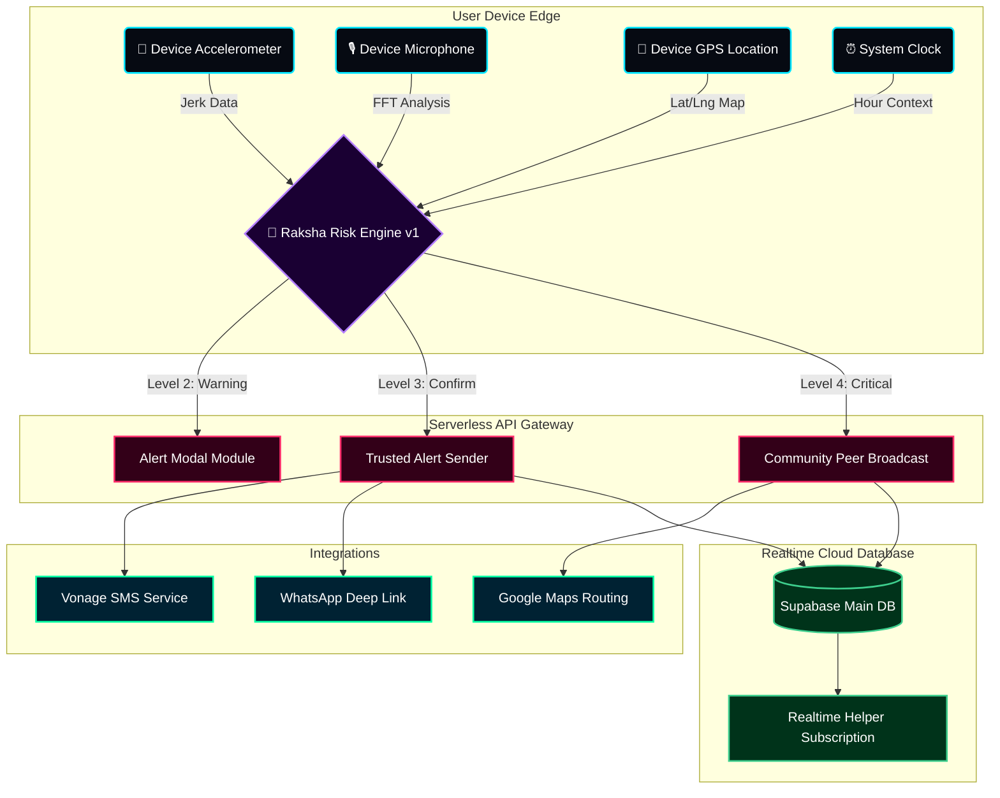
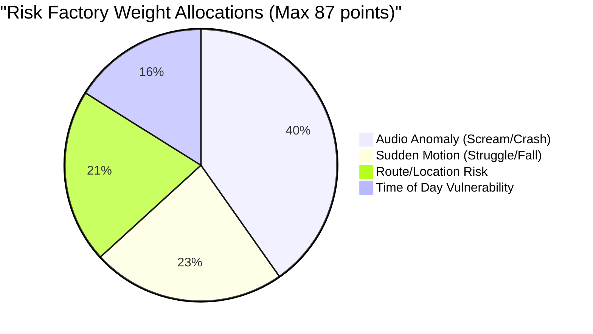
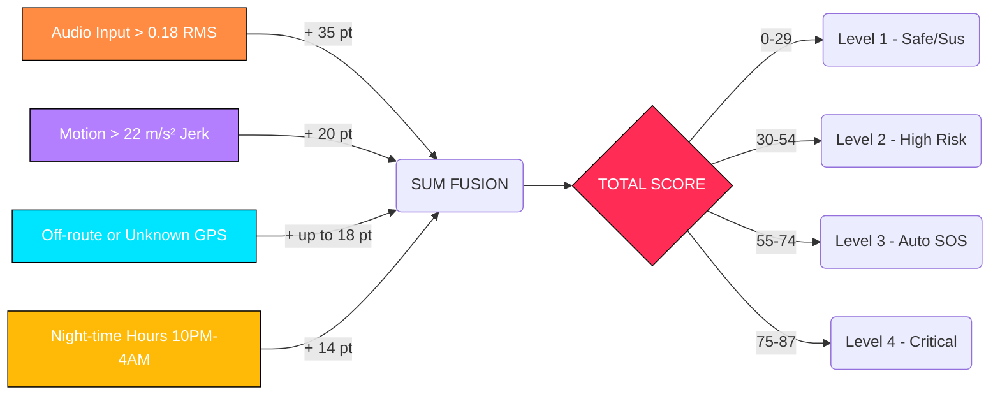
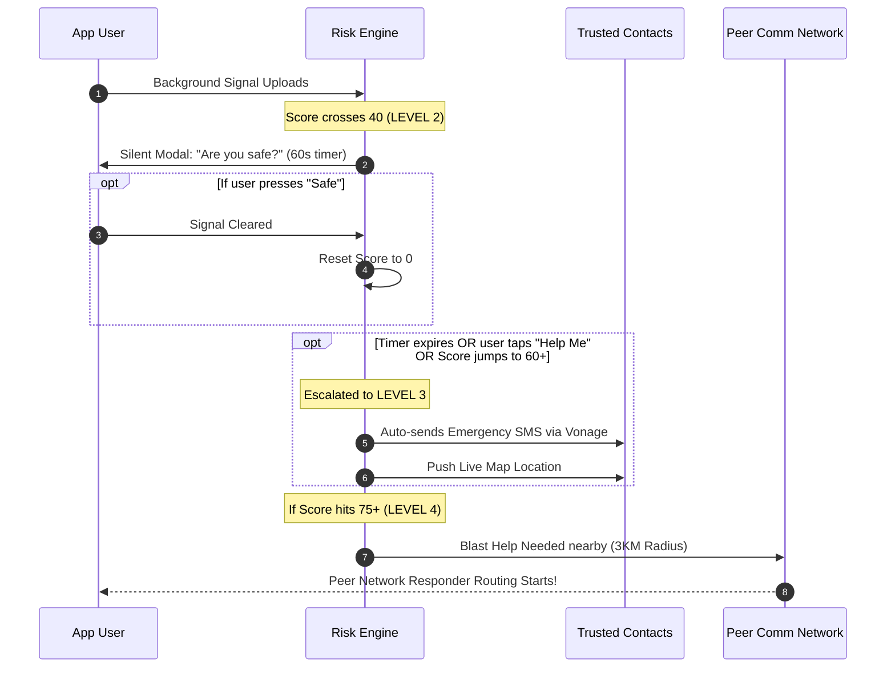

<div align="center">



<a href="https://rakshanet.vercel.app">
  
</a>

<br/>
<br/>

[](https://nextjs.org)
[](https://reactjs.org)
[](https://supabase.io)
[](https://typescriptlang.org)
[](https://tailwindcss.com)

<br/>

**Built at Hackathon 2026 🏆 Winner Track**

<p align="center">
  RakshaNet is an intelligent AI safety ecosystem that actively monitors biometric, motion, audio, and geospatial signals to detect distress. It acts as an invisible shield—automatically initiating SOS protocols when you cannot.
</p>

---

</div>

<br/>

<div align="center">
  <h2>⚡ SUPERCHARGED TECH STACK ⚡</h2>
  <br/>
  <a href="https://skillicons.dev">
    
  </a>
  <br/><br/>
  <a href="https://skillicons.dev">
    
  </a>
</div>

<br/>
<br/>

## 🌟 Intelligent System Architecture

RakshaNet is built on a modular Edge-Ready Architecture leveraging real-time sensor fusion and serverless execution. 



<br/>

## 🧮 How the "Raksha Risk Score" Works

The core of the application is a fully deterministic, rule-based additive logic engine that scores physical risk vectors continuously (every 2 seconds).



### Flow of Execution



<br/>
<br/>

## 🚨 The 4-Tier Automated Escalation Ladder

RakshaNet is designed to handle false positives gracefully while guaranteeing absolute escalation during genuine life-threatening emergencies, without the user ever clicking a button.



---

<br/>

## 🛠 Features Deep-Dive

<details open>
  <summary><b><font size="+1">🎙️ SilentSOS Audio API</font></b></summary>
  <blockquote>
    <p><b>🧠 Innovation Detail:</b> Analyzes soundwave FFT patterns strictly locally inside the browser. Identifies frequency spikes corresponding to human screams or glass breaking.</p>
    <p><b>🔒 Privacy / Security:</b> <em>Local Only.</em> Mic data is processed on-device. Zero audio files are transmitted to servers protecting privacy.</p>
  </blockquote>
</details>

<details open>
  <summary><b><font size="+1">📳 Motion Jerk Engine</font></b></summary>
  <blockquote>
    <p><b>🧠 Innovation Detail:</b> Hooks into HTML5 <code>DeviceMotion</code>. Reads 3D axis acceleration data at 12fps to identify sudden delta spikes >22m/s².</p>
    <p><b>🔒 Privacy / Security:</b> <em>Battery Efficient.</em> Automatically disables itself when the device is idle, minimizing background drain.</p>
  </blockquote>
</details>

<details open>
  <summary><b><font size="+1">📡 Realtime Peer Radar</font></b></summary>
  <blockquote>
    <p><b>🧠 Innovation Detail:</b> Utilizes Supabase <code>postgres_changes</code>. Any nearby user opted-in as a "Helper" instantly sees a pulsing pop-up radar alert when you're in distress.</p>
    <p><b>🔒 Privacy / Security:</b> <em>Encrypted Socket.</em> Data streams securely over wss:// with strict RLS (Row Level Security).</p>
  </blockquote>
</details>

<details open>
  <summary><b><font size="+1">🗺️ Smart Safe-Route</font></b></summary>
  <blockquote>
    <p><b>🧠 Innovation Detail:</b> Fuses Google Maps Directions API with customized Haversine off-route vector tracking. Evaluates path corridors dynamically.</p>
    <p><b>🔒 Privacy / Security:</b> <em>Anonymous Paths.</em> Route history clears immediately after session logic concludes.</p>
  </blockquote>
</details>

---

<br/>

<div align="center">
  <h2>🛡️ Meet the Obsidian HoloShield Interface</h2>
  _Loading_Command_Center...;>_Rendering_Glassmorphic_UI...;>_Ready_For_Deployment" />
</div>

RakshaNet abandons boring layouts for a cutting-edge **Cyber-Security Command Center** aesthetic:
- **Glassmorphic Panels:** Intense backdrop blur (`backdrop-filter`) with semi-transparent panel borders mimicking tactical HUDs.
- **Micro-Animations:** Driven by `framer-motion`, every number tick, chart load, and action pulses and fluidly enters the frame ensuring the interface feels "alive".
- **Dynamic Context Glows:** The UI changes global accent colors automatically based on the risk level. Ambient shadows pulse red during Level 4 Crits.

<br/>

> **"Because safety shouldn't feel obsolete. It should feel like state-of-the-art protection."**

---

<br/>

<div align="center">
  <h2>🚀 Setup Your Local Instance</h2>
</div>

#### Installation

```bash
# 1. Clone the repo
git clone https://github.com/VishalDeep1377/RakshaNet.git

# 2. Enter workspace
cd rakshanet

# 3. Install packages
npm install
```

#### Environment Variables

Create `.env.local`:
```bash
NEXT_PUBLIC_SUPABASE_URL=your_supabase_url
NEXT_PUBLIC_SUPABASE_ANON_KEY=your_supabase_key
NEXT_PUBLIC_GOOGLE_MAPS_API_KEY=your_google_maps_key
VONAGE_API_KEY=your_vonage_key
VONAGE_API_SECRET=your_vonage_secret
```

#### Boot Server
```bash
npm run dev
```

<br/>

<p align="center">
  
  <br/>
  <br/>
  <i>Open Source for a Safer Tomorrow.</i>
</p>
