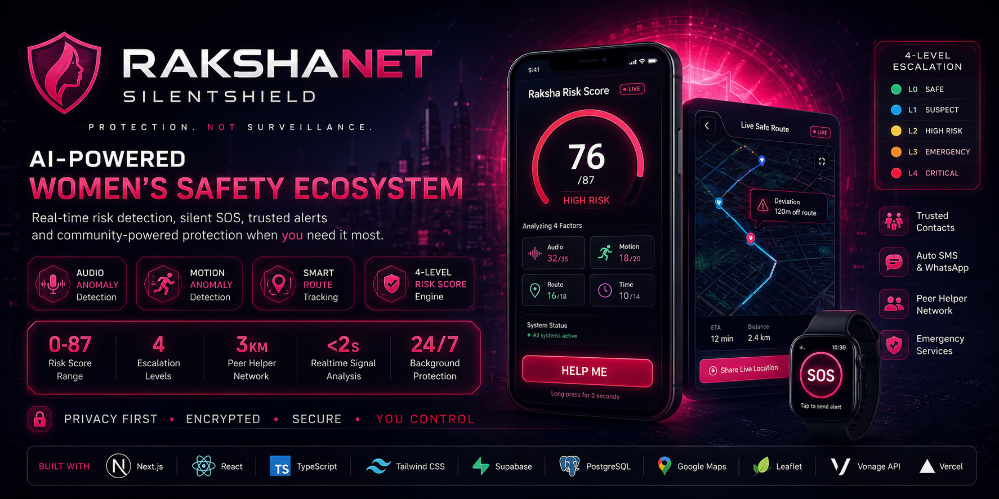
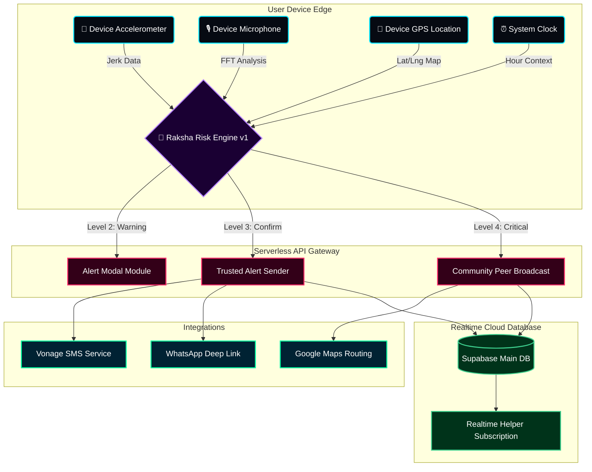
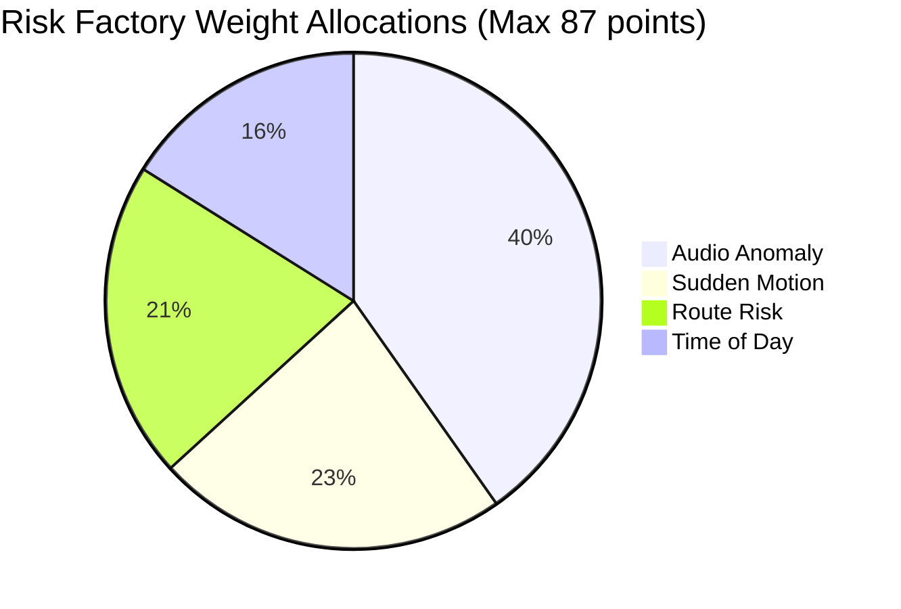
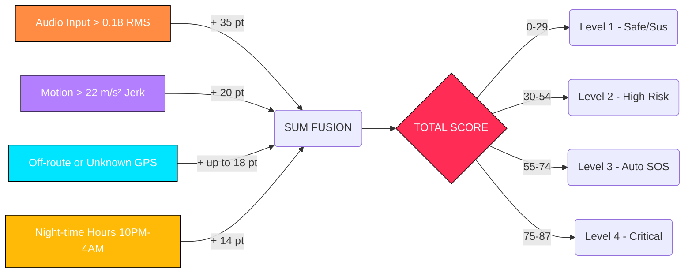
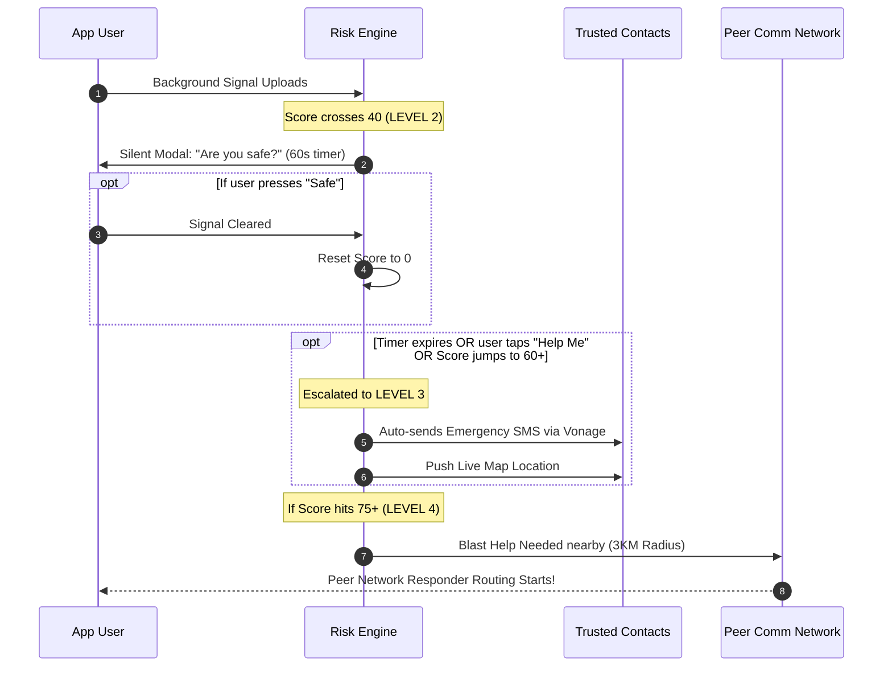

<div align="center">



<a href="https://rakshanet.vercel.app">
  
</a>

<br/>


<br/><br/>


### 🛡️ **Protection. Not Surveillance.**

**AI-Powered Personal Safety Network for Women — Real-Time Risk Scoring, Silent SOS & Trusted Responder Ecosystem**

<br/>

[](https://nextjs.org)
[](https://reactjs.org)
[](https://supabase.io)
[](https://typescriptlang.org)
[](https://tailwindcss.com)
[](https://framer.com/motion)
[](https://developers.google.com/maps)
[](https://vonage.com)
[](https://leafletjs.com)
[](https://vercel.com)

<br/>


<br/>

**Built at Hackathon 2026 🏆 Winner Track**

<p align="center">
  RakshaNet is an intelligent AI safety ecosystem that actively monitors biometric, motion, audio, and geospatial signals to detect distress. It acts as an invisible shield — automatically initiating SOS protocols when you cannot.
</p>

<p align="center"><b><i>"The app acts for you when you cannot act for yourself."</i></b></p>

</div>

---

<div align="center">
  <h2>⚡ SUPERCHARGED TECH STACK ⚡</h2>
  <br/>
  <a href="https://skillicons.dev">
    
  </a>
  <br/><br/>
  <a href="https://skillicons.dev">
    
  </a>
</div>

<br/>

## 🌟 What is RakshaNet?

> **RakshaNet SilentShield** is an advanced AI-powered personal safety platform designed specifically for women. It combines real-time biometric sensor fusion, audio anomaly detection, motion analysis, GPS route tracking, and a rule-based **Raksha Risk Score Engine** to proactively detect danger — and automatically escalate to trusted contacts, emergency services, and nearby community helpers, without requiring the user to take any action.

<br/>

## 🎯 Key Features

<table>
<tr>
<td width="50%" valign="top">

### 🔴 Raksha Risk Score Engine
- Rule-based additive distress scoring (0–87)
- 4-factor fusion: Audio + Motion + Route + Time
- 4 escalation levels with automated actions
- Real-time recalculation every 2 seconds

### 🎙️ SilentSOS Audio API
- Web Audio API microphone monitoring, processed **strictly locally**
- Scream/glass-break detection via FFT frequency spikes
- Real-time dB visualizer in the widget
- Zero audio files ever transmitted to servers

### 📳 Motion Jerk Engine
- Hooks into HTML5 `DeviceMotion` at 12fps
- Detects sudden delta spikes > 22 m/s² (struggle/fall)
- Battery efficient — auto-disables when device is idle
- Continuous background monitoring with auto-reset

</td>
<td width="50%" valign="top">

### 🗺️ Smart Safe-Route Intelligence
- Fuses Google Maps Directions API with Leaflet fallback
- Custom Haversine off-route vector tracking
- Live GPS location tracking & route deviation monitoring
- Anonymous paths — route history clears after session

### 📡 Realtime Peer Radar
- Supabase `postgres_changes` powers instant helper alerts
- Opted-in "Helpers" get a pulsing radar pop-up when nearby
- Encrypted `wss://` socket streams with strict RLS

### 💬 AI Safety Companion (Chat)
- Context-aware AI assistant, distress-score-aware responses
- Natural language emergency commands
- Location-informed advice

### 🔐 Privacy-First Design
- End-to-end encrypted incident logs & evidence vault
- No background surveillance — sensors activate on request
- Local processing wherever possible

</td>
</tr>
</table>

---

## 🧠 Intelligent System Architecture

RakshaNet is built on a modular Edge-Ready Architecture leveraging real-time sensor fusion and serverless execution.



<br/>

## 🧮 How the "Raksha Risk Score" Works

The core of the application is a fully deterministic, rule-based additive logic engine that scores physical risk vectors continuously (every 2 seconds).



### Flow of Execution



### Engine Data Path (Signal → Score → Level → Action)

```
┌─────────────────────────────────────────────────────────────────────────────┐
│                        RAKSHA RISK SCORE ENGINE v1                          │
│                    Rule-Based Additive Distress Scoring                     │
└─────────────────────────────────────────────────────────────────────────────┘

  ┌─────────────────┐   ┌─────────────────┐   ┌─────────────────┐   ┌──────────────┐
  │  🎙️ AUDIO INPUT │   │  📳 MOTION INPUT │   │  📍 ROUTE INPUT  │   │ ⏰ TIME INPUT │
  │ Web Audio API   │   │ DeviceMotion    │   │ GPS Coordinates  │   │ Hour of Day  │
  │ Frequency FFT   │   │ Accelerometer   │   │ Location History │   │ 0-23 (local) │
  │ Scream/cry det. │   │ Jerk detection  │   │ Known locations  │   │              │
  └────────┬────────┘   └────────┬────────┘   └────────┬────────┘   └──────┬───────┘
           │ MAX: 35              │ MAX: 20              │ MAX: 18           │ MAX: 14
           └──────────────────── ▼ SUM FUSION ▼ ─────────────────────────────┘
                                         │
                              TOTAL = Audio + Motion + Route + Time
                              MAX SCORE = 87  |  Manual SOS → instantly 87 (CRIT)
                                         │
                        ┌────────────────▼───────────────────────┐
                        │         RAKSHA LEVEL MAPPER            │
                        │  Score  0     → SAFE       (Level 0)  │
                        │  Score  1–29  → SUSPICIOUS (Level 1)  │
                        │  Score 30–54  → HIGH_RISK  (Level 2)  │
                        │  Score 55–74  → CONFIRMED  (Level 3)  │
                        │  Score 75–87  → CRITICAL   (Level 4)  │
                        └────────────────┬───────────────────────┘
                                         │
          ┌──────────────┬───────────────┼────────────────┬──────────────────┐
          ▼              ▼               ▼                ▼                  ▼
    ┌──────────┐   ┌──────────┐   ┌──────────┐    ┌──────────┐       ┌──────────┐
    │ LEVEL 0  │   │ LEVEL 1  │   │ LEVEL 2  │    │ LEVEL 3  │       │ LEVEL 4  │
    │  SAFE    │   │SUSPICIOUS│   │HIGH RISK │    │CONFIRMED │       │CRITICAL  │
    │ Monitor  │   │ Display  │   │ Silent   │    │ Auto-SOS │       │ Police + │
    │ Only     │   │ Warning  │   │ Check-In │    │ +Trusted │       │ Peer Net │
    └──────────┘   └──────────┘   └──────────┘    └──────────┘       └──────────┘
```

---

## 🚨 The 4-Tier Automated Escalation Ladder

RakshaNet is designed to handle false positives gracefully while guaranteeing absolute escalation during genuine life-threatening emergencies, without the user ever clicking a button.



## 🛠 Features Deep-Dive

<details open>
  <summary><b><font size="+1">🎙️ SilentSOS Audio API</font></b></summary>
  <blockquote>
    <p><b>🧠 Innovation Detail:</b> Analyzes soundwave FFT patterns strictly locally inside the browser. Identifies frequency spikes corresponding to human screams or glass breaking.</p>
    <p><b>🔒 Privacy / Security:</b> <em>Local Only.</em> Mic data is processed on-device. Zero audio files are transmitted to servers, protecting privacy.</p>
  </blockquote>
</details>

<details open>
  <summary><b><font size="+1">📳 Motion Jerk Engine</font></b></summary>
  <blockquote>
    <p><b>🧠 Innovation Detail:</b> Hooks into HTML5 <code>DeviceMotion</code>. Reads 3D axis acceleration data at 12fps to identify sudden delta spikes >22 m/s².</p>
    <p><b>🔒 Privacy / Security:</b> <em>Battery Efficient.</em> Automatically disables itself when the device is idle, minimizing background drain.</p>
  </blockquote>
</details>

<details open>
  <summary><b><font size="+1">📡 Realtime Peer Radar</font></b></summary>
  <blockquote>
    <p><b>🧠 Innovation Detail:</b> Utilizes Supabase <code>postgres_changes</code>. Any nearby user opted-in as a "Helper" instantly sees a pulsing pop-up radar alert when you're in distress.</p>
    <p><b>🔒 Privacy / Security:</b> <em>Encrypted Socket.</em> Data streams securely over wss:// with strict RLS (Row Level Security).</p>
  </blockquote>
</details>

<details open>
  <summary><b><font size="+1">🗺️ Smart Safe-Route</font></b></summary>
  <blockquote>
    <p><b>🧠 Innovation Detail:</b> Fuses Google Maps Directions API with customized Haversine off-route vector tracking. Evaluates path corridors dynamically.</p>
    <p><b>🔒 Privacy / Security:</b> <em>Anonymous Paths.</em> Route history clears immediately after session logic concludes.</p>
  </blockquote>
</details>

---


## 🚀 Getting Started

### Prerequisites

| Tool | Version | Purpose |
|------|---------|---------|
| Node.js | `≥ 20` | Runtime |
| npm / pnpm | `≥ 10` | Package manager |
| Supabase account | — | Database + Auth |
| Vonage account | — | SMS delivery |
| Google Maps API key | — | Maps & geocoding |

### 1. Clone & Install

```bash
git clone https://github.com/VishalDeep1377/RakshaNet.git
cd rakshanet
npm install
```

### 2. Configure Environment

Create `.env.local` in the project root:

```env
# Supabase
NEXT_PUBLIC_SUPABASE_URL=https://xxxxxxxxxxxx.supabase.co
NEXT_PUBLIC_SUPABASE_ANON_KEY=your_anon_key_here
SUPABASE_SERVICE_ROLE_KEY=your_service_role_key_here

# Google Maps (for routing + geocoding)
NEXT_PUBLIC_GOOGLE_MAPS_API_KEY=your_google_maps_key

# Vonage SMS (for Level 3 & 4 alerts)
VONAGE_API_KEY=your_vonage_api_key
VONAGE_API_SECRET=your_vonage_api_secret

# AI Chat (for AI safety companion)
OPENAI_API_KEY=sk-your_openai_key
```

### 3. Database Setup

Run the Supabase migrations:

```bash
# Create required tables
supabase db push
# Or paste the schema from /supabase/migrations/
```


### 4. Boot Server

```bash
npm run dev
```

Open [http://localhost:3000](http://localhost:3000)

---

## 🧬 Tech Stack Deep Dive

| Layer | Technology | Why We Chose It |
|-------|-----------|-----------------|
| **Framework** | Next.js 16 (App Router) | Server components, API routes, ISR caching |
| **UI Library** | React 19 | Concurrent features, useTransition for smooth UX |
| **Language** | TypeScript 5 | Type-safe distress score interfaces & engine contracts |
| **Styling** | Tailwind CSS v4 + Vanilla CSS | Design token system, glassmorphism, dark theme |
| **Animation** | Framer Motion 13 | Physics-based springs, AnimatePresence for modals |
| **Database** | Supabase (PostgreSQL) | Realtime subscriptions for peer alerts, RLS security |
| **Auth** | Supabase Auth | Email + OAuth, session cookies, SSR-compatible |
| **SMS** | Vonage API | Reliable delivery to Indian numbers, E.164 format |
| **Maps** | Google Maps + Leaflet.js | Dual-engine: API routing + open-source fallback |
| **Icons** | Lucide React | Consistent icon system, tree-shakeable |
| **Audio** | Web Audio API (native) | FFT frequency analysis, no external dependency |
| **Motion** | DeviceMotion API (native) | Accelerometer access, jerk threshold detection |
| **i18n** | Custom LanguageContext | 7 languages: EN, HI, TA, BN, TE, MR, PA |
| **Deployment** | Vercel | Edge network, automatic HTTPS, preview deployments |

---
---

## 🔐 Security & Privacy

```
┌─────────────────────────────────────────────────────────────┐
│                     PRIVACY ARCHITECTURE                     │
│                                                             │
│  ✅ Row Level Security — users only see their own data      │
│  ✅ Audio processed locally — no audio sent to servers      │
│  ✅ GPS history stored only on-device during session        │
│  ✅ Vault files encrypted before Supabase Storage upload    │
│  ✅ No passive surveillance — sensors activate on request   │
│  ✅ Supabase Auth — JWT sessions, no plaintext passwords    │
│  ✅ HTTPS enforced — all API calls over TLS 1.3             │
│  ✅ No third-party tracking or analytics SDK                │
└─────────────────────────────────────────────────────────────┘
```

---


## 🏆 Why RakshaNet Wins

| Challenge | Our Solution |
|-----------|-------------|
| **"I can't press SOS in danger"** | Automatic escalation via sensor fusion — no user action needed |
| **"False alarms waste responders"** | 4-tier graduated system: warning → check-in → SOS → emergency |
| **"Trusted contacts don't know where I am"** | Live Google Maps link + address in every SMS |
| **"Police take time, no one else can help"** | Peer broadcast notifies nearby RakshaNet users instantly |
| **"I'm scared, I don't know what to say"** | AI companion knows your distress score and guides you |
| **"It'll drain my battery"** | Sensors are opt-in; only GPS is always-on (browser native) |
| **"I don't trust apps with my data"** | All audio processed locally, RLS enforced, no third-party tracking |

---

## 📜 License

MIT License — Built with ❤️ for women's safety across India.

RakshaNet is open-source and free to use, modify, and deploy. If you build on this, please pay it forward — add features, fix bugs, or support women's safety NGOs.

---

<div align="center">

## 👥 Team

**Built at Hackathon 2026** — *"Technology in service of safety, dignity, and freedom."*

<br/>

```
प्रोटेक्शन, निगरानी नहीं।
Protection. Not Surveillance.
```

<br/>

[](https://github.com)
[](https://github.com)


<br/><br/>

<sub>RakshaNet SilentShield v1.0 · Next.js 16 · React 19 · Supabase · Vonage · Google Maps · Framer Motion</sub>

<br/>

<i>Open Source for a Safer Tomorrow.</i>

</div>
